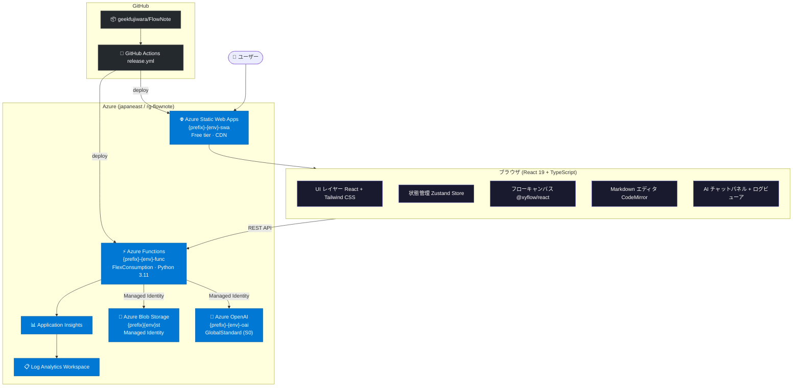
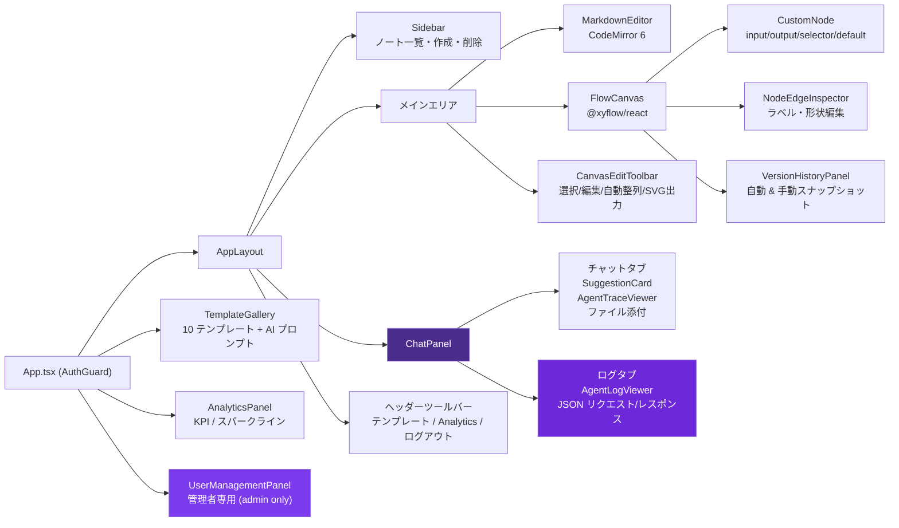
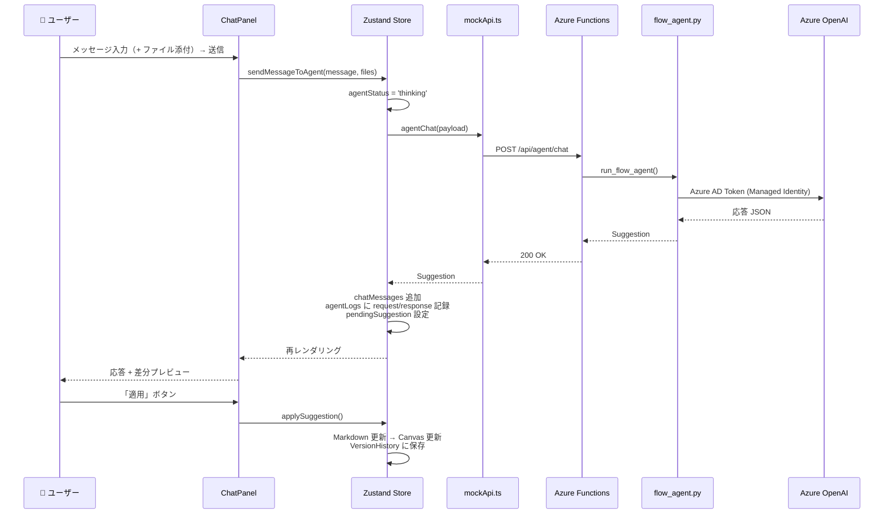
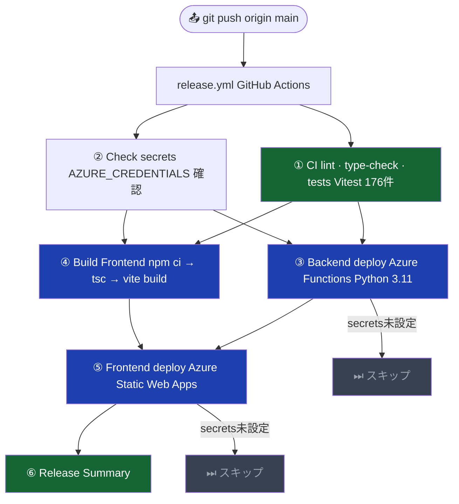
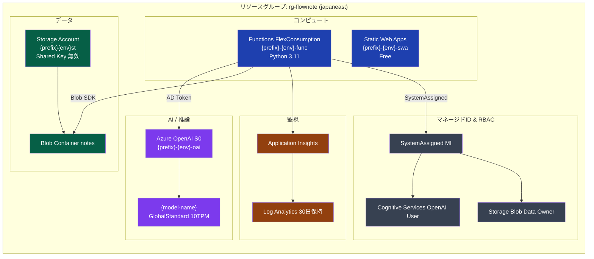

# FlowNote

<p align="center">
  
</p>

<p align="center">
  <strong>マークダウンで書いて、AI で育てる。次世代フローチャート Web アプリ。</strong>
</p>

<p align="center">
  <a href="https://github.com/geekfujiwara/FlowNote/actions/workflows/release.yml">
    
  </a>
  
  
  
  
  
  
</p>

<p align="center">
  <a href="https://x.com/geekfujiwara">🐦 X (Twitter)</a> ·
  <a href="https://github.com/geekfujiwara">👤 GitHub</a> ·
  <a href="#ローカル開発">🚀 Getting Started</a> ·
  <a href="#azure-デプロイ">☁️ Deploy to Azure</a>
</p>

---

## FlowNote とは

**FlowNote** は、**マークダウンで書く × インタラクティブキャンバスで見る × AI エージェントで育てる**、3つの体験を1つに統合したフローチャート Web アプリケーションです。

```
# 設計書をテキストで書く

flow
[[start]] 要件定義
[design] 設計
[impl] 実装
{review} レビューOK?
((done)) リリース
[fix] 修正

[start] -> [design]
[design] -> [impl]
[impl] -> {review}
{review} -> ((done)) : Yes
{review} -> [fix] : No
[fix] -> [impl]
```

↓ リアルタイムでキャンバスに自動反映 ↓

「このフローに承認フローを追加して」→ AI が差分プレビューを提案

### なぜ FlowNote なのか

| 課題 | FlowNote の解決策 |
|---|---|
| GUI ツールはマウス操作が多く、構造変更が手間 | テキストで書けばキャンバスに即反映。コピペ・検索・バージョン管理も自由 |
| AI に頼んでも意図しない変更が入りやすい | **差分プレビュー → 適用 / 破棄**で安全に AI の提案を取り込める |
| 何をどう変えたか把握しにくい | **バージョン履歴**で変更を自動記録。任意の状態に1クリックで戻れる |
| ゼロから設計するのは時間がかかる | **10種のテンプレート**と AI 専用プロンプトで即スタート |
| AI が何をしたか不透明 | **エージェントログビューア**で全リクエスト・レスポンス JSON を確認可能 |

---

## アーキテクチャ

### システム全体構成


```mermaid
graph TB
    subgraph Client["ブラウザ (React 19 + TypeScript)"]
        direction TB
        UI["UI レイヤー React + Tailwind CSS"]
        Store["状態管理 Zustand Store"]
        Canvas["フローキャンバス @xyflow/react"]
        Editor["Markdown エディタ CodeMirror"]
        Chat["AI チャットパネル + ログビューア"]
    end

    subgraph Azure["Azure (japaneast / rg-flownote)"]
        SWA["🌐 Azure Static Web Apps\n{prefix}-{env}-swa\nFree tier · CDN"]
        Func["⚡ Azure Functions\n{prefix}-{env}-func\nFlexConsumption · Python 3.11"]
        OAI["🤖 Azure OpenAI\n{prefix}-{env}-oai\nGlobalStandard (S0)"]
        Blob["💾 Azure Blob Storage\n{prefix}{env}st\nManaged Identity"]
        APPI["📊 Application Insights"]
        LAW["📋 Log Analytics Workspace"]
    end

    subgraph GitHub["GitHub"]
        Repo["📦 geekfujiwara/FlowNote"]
        Actions["🔄 GitHub Actions release.yml"]
    end

    User(["👤 ユーザー"]) --> SWA
    SWA --> Client
    Client -- "REST API" --> Func
    Func -- "Managed Identity" --> OAI
    Func -- "Managed Identity" --> Blob
    Func --> APPI
    APPI --> LAW
    Repo --> Actions
    Actions -- "deploy" --> SWA
    Actions -- "deploy" --> Func

    classDef azure fill:#0078d4,color:#fff,stroke:#005a9e
    classDef client fill:#1a1a2e,color:#fff,stroke:#4444aa
    classDef github fill:#24292e,color:#fff,stroke:#444
    class SWA,Func,OAI,Blob,APPI,LAW azure
    class UI,Store,Canvas,Editor,Chat client
    class Repo,Actions github
```

---

### フロントエンド コンポーネント構成


```mermaid
graph LR
    App["App.tsx (AuthGuard)"]

    App --> Layout["AppLayout"]
    Layout --> Sidebar["Sidebar\nノート一覧・作成・削除"]
    Layout --> Main["メインエリア"]
    Layout --> ChatPanel["ChatPanel"]
    Layout --> Toolbar["ヘッダーツールバー\nテンプレート / Analytics / ログアウト"]

    Main --> Editor["MarkdownEditor\nCodeMirror 6"]
    Main --> Canvas["FlowCanvas\n@xyflow/react"]
    Main --> EditToolbar["CanvasEditToolbar\n選択/編集/自動整列/SVG出力"]

    ChatPanel --> Tab1["チャットタブ\nSuggestionCard\nAgentTraceViewer\nファイル添付"]
    ChatPanel --> Tab2["ログタブ\nAgentLogViewer\nJSON リクエスト/レスポンス"]

    Canvas --> CustomNode["CustomNode\ninput/output/selector/default"]
    Canvas --> Inspector["NodeEdgeInspector\nラベル・形状編集"]
    Canvas --> VersionPanel["VersionHistoryPanel\n自動 & 手動スナップショット"]

    App --> Templates["TemplateGallery\n10 テンプレート + AI プロンプト"]
    App --> Analytics["AnalyticsPanel\nKPI / スパークライン"]
    App --> Admin["UserManagementPanel\n管理者専用 (admin only)"]

    style ChatPanel fill:#4b2d8e,color:#fff
    style Tab2 fill:#6d28d9,color:#fff
    style Admin fill:#7c3aed,color:#fff
```

---

### AI エージェント データフロー


```mermaid
sequenceDiagram
    participant U as 👤 ユーザー
    participant CP as ChatPanel
    participant ZS as Zustand Store
    participant API as mockApi.ts
    participant AZF as Azure Functions
    participant AFW as flow_agent.py
    participant AOAI as Azure OpenAI

    U->>CP: メッセージ入力（+ ファイル添付）→ 送信
    CP->>ZS: sendMessageToAgent(message, files)
    ZS->>ZS: agentStatus = 'thinking'
    ZS->>API: agentChat(payload)
    API->>AZF: POST /api/agent/chat
    AZF->>AFW: run_flow_agent()
    AFW->>AOAI: Azure AD Token (Managed Identity)
    AOAI-->>AFW: 応答 JSON
    AFW-->>AZF: Suggestion
    AZF-->>API: 200 OK
    API-->>ZS: Suggestion
    ZS->>ZS: chatMessages 追加<br/>agentLogs に request/response 記録<br/>pendingSuggestion 設定
    ZS-->>CP: 再レンダリング
    CP-->>U: 応答 + 差分プレビュー
    U->>CP: 「適用」ボタン
    CP->>ZS: applySuggestion()
    ZS->>ZS: Markdown 更新 → Canvas 更新<br/>VersionHistory に保存
```

---

### CI/CD パイプライン


```mermaid
flowchart TD
    Push(["📤 git push origin main"]) --> W["release.yml GitHub Actions"]

    W --> J1["① CI lint · type-check · tests Vitest 176件"]
    W --> J2["② Check secrets AZURE_CREDENTIALS 確認"]

    J1 --> J3["③ Backend deploy Azure Functions Python 3.11"]
    J2 --> J3
    J1 --> J4["④ Build Frontend npm ci → tsc → vite build"]
    J2 --> J4

    J3 --> J5["⑤ Frontend deploy Azure Static Web Apps"]
    J4 --> J5
    J5 --> J6["⑥ Release Summary"]

    J3 -->|secrets未設定| Skip1["⏭ スキップ"]
    J5 -->|secrets未設定| Skip2["⏭ スキップ"]

    style J1 fill:#166534,color:#fff
    style J3 fill:#1e40af,color:#fff
    style J4 fill:#1e40af,color:#fff
    style J5 fill:#1e40af,color:#fff
    style J6 fill:#166534,color:#fff
    style Skip1 fill:#374151,color:#9ca3af
    style Skip2 fill:#374151,color:#9ca3af
```

---

### Azure インフラ構成 (Bicep IaC)


```mermaid
graph TB
    subgraph RG["リソースグループ: rg-flownote (japaneast)"]
        direction TB

        subgraph Compute["コンピュート"]
            SWA["Static Web Apps\n{prefix}-{env}-swa\nFree"]
            Func["Functions FlexConsumption\n{prefix}-{env}-func\nPython 3.11"]
        end

        subgraph AI["AI / 推論"]
            OAI["Azure OpenAI S0\n{prefix}-{env}-oai"]
            Model["{model-name}\nGlobalStandard 10TPM"]
            OAI --> Model
        end

        subgraph Data["データ"]
            ST["Storage Account\n{prefix}{env}st\nShared Key 無効"]
            Blob["Blob Container notes"]
            ST --> Blob
        end

        subgraph Monitor["監視"]
            APPI["Application Insights"]
            LAW["Log Analytics 30日保持"]
            APPI --> LAW
        end

        subgraph IAM["マネージドID & RBAC"]
            MI["SystemAssigned MI"]
            R1["Storage Blob Data Owner"]
            R2["Cognitive Services OpenAI User"]
            MI --> R1
            MI --> R2
        end

        Func -- SystemAssigned --> MI
        Func --> APPI
        Func -- Blob SDK --> Blob
        Func -- AD Token --> OAI
    end

    classDef compute fill:#1e40af,color:#fff
    classDef ai fill:#7c3aed,color:#fff
    classDef data fill:#065f46,color:#fff
    classDef monitor fill:#92400e,color:#fff
    classDef iam fill:#374151,color:#fff
    class SWA,Func compute
    class OAI,Model ai
    class ST,Blob data
    class APPI,LAW monitor
    class MI,R1,R2 iam
```

---

## 主な機能

### 📝 マークダウン × リアルタイムキャンバス

独自の `flow` コードブロック記法でフローを定義すると、右側のキャンバスにリアルタイムで反映されます。

- **CodeMirror 6 ベースのエディタ**でシンタックスハイライトに対応
- テキスト変更が即座に @xyflow/react キャンバスへ同期
- ノードを直接クリックして **インスペクタ** でラベルや形状を編集可能

### 🤖 AI エージェント（差分プレビュー付き）

チャットパネルから Azure OpenAI × Microsoft Agent Framework の AI エージェントに指示できます。

- 「承認ステップを追加して」「条件分岐を整理して」など自然言語で指示
- AI の提案は **差分プレビュー**（変更ノードをハイライト表示）で確認
- **適用** または **破棄** を選べるので意図しない変更を防止
- **ファイル添付**対応：画像（OCR）・PDF・Word・PowerPoint・Excel・SVG をアップロードしてフロー生成の材料に活用

### 📎 ファイル添付 & ドキュメント解析

チャットに直接ファイルをドロップして AI の入力として使えます。

| ファイル形式 | 処理方法 |
|---|---|
| JPEG / PNG / GIF / WebP / BMP | Vision API で OCR テキスト抽出 |
| SVG | ブラウザ上で `<text>` / `<tspan>` をパース・抽出 |
| PDF / DOCX / PPTX / XLSX | バックエンドでテキスト解析 |
| Markdown / テキスト | そのままコンテキストとして送信 |

### 🎨 インタラクティブキャンバス

[@xyflow/react](https://xyflow.com/) 製のキャンバスで直感的な操作ができます。

- ノードのドラッグ移動・接続ハンドルからのエッジ追加
- **自動レイアウト**（Dagre）で複雑なフローを一発整列
- **選択 / 編集モード** 切り替えで誤操作を防止
- ズーム・パン・MiniMap・グリッドバックグラウンド
- ドラッグ中のアニメーション接続線（グロー + ダッシュ）

### 📤 SVG エクスポート

現在のキャンバス全体をダークテーマを維持したまま **スタンドアロン SVG** としてダウンロードできます。そのままドキュメント・スライドに貼り付けて使用可能です。

### 🔄 バージョン履歴

- フローへの変更を自動スナップショットとして記録（タイムスタンプ・説明付き）
- **手動スナップショット**で任意のタイミングに名前付き保存
- 任意の過去バージョンに **1クリックで復元**

### 📋 テンプレートギャラリー（10種）

目的別テンプレートを即適用。各テンプレートには AI 専用プロンプトと推奨プロンプト候補が付属します。

| カテゴリ | テンプレート |
|---|---|
| 🔍 分析 | フィッシュボーンチャート / SWOT 分析 / リスク分析マトリクス |
| 📋 企画 | マインドマップ / プロダクトロードマップ / カスタマージャーニーマップ / ユーザーストーリーマップ |
| ⚙️ プロセス | プロセスフローチャート / ステートマシン図 |
| 🏢 組織 | 組織図 |

「テンプレートで上書き」でフローを差し替えるか、「AI で実行」で現在のフローをベースに AI が拡張します。

### 🪵 エージェントログビューア

- 全リクエスト・レスポンスの JSON をリアルタイム記録
- クリックで展開。**リクエスト / レスポンス** タブを切り替えて確認
- クリップボードコピー機能

### 📊 アナリティクスダッシュボード

- KPI カード：ノート数・ノード数・エッジ数・AI 使用回数・バージョン保存数など
- スパークライン / 水平バーチャートで活動推移を可視化
- ノードタイプ分布（処理 / 分岐 / 開始 / 終了の比率）

### 👥 管理者パネル（User Management）

管理者アカウント限定で全ユーザーの利用状況を一覧できます。

- ユーザーごとのアクティビティ集計（ノート作成・AI 送信・テンプレート適用 など）
- 日次アクティビティチャート・オンライン状態バッジ

### 🔐 認証

| モード | 説明 |
|---|---|
| パスワード認証 | デモ・個人利用向け。SHA-256 ハッシュをビルド時に埋め込み |
| Microsoft Entra ID (MSAL) | 組織内展開向け。ポップアップ形式の SSO ログイン |

### 📡 リアルタイム同期（SignalR）

Azure SignalR Service をプロビジョニングした環境では、複数ユーザーがリアルタイムでノートの更新を受信できます（`VITE_SIGNALR_ENABLED=true` で有効化）。


---

## 技術スタック

### フロントエンド

| ライブラリ | バージョン | 用途 |
|---|---|---|
| React | 19 | UI フレームワーク |
| TypeScript | 5.x | 型安全な開発 |
| Vite | 6 | 高速ビルド・HMR 開発サーバー |
| @xyflow/react | 12 | フローキャンバス（旧 React Flow） |
| @uiw/react-codemirror | 4 | Markdown エディタ |
| Zustand | 5 | グローバル状態管理 |
| Tailwind CSS | 4 | ユーティリティファーストスタイリング |
| @dagrejs/dagre | 1 | 有向グラフ自動レイアウト |
| @azure/msal-react | 2 | Microsoft Entra ID (MSAL) 認証 |
| @microsoft/signalr | 8 | Azure SignalR リアルタイム通信 |
| @microsoft/applicationinsights-web | 3 | Application Insights テレメトリ |
| lucide-react | 0.468 | アイコンセット |

### バックエンド

| 技術 | 説明 |
|---|---|
| Azure Functions v2 (Python 3.11) | サーバーレス API（FlexConsumption プラン） |
| Microsoft Agent Framework | AI エージェントオーケストレーション |
| Azure OpenAI / OpenAI | GPT モデル推論エンジン |
| Azure Default Credential | Managed Identity によるキーレス認証 |

### テスト

| ツール | バージョン | 用途 |
|---|---|---|
| Vitest | 3.x | テストランナー |
| @testing-library/react | 16 | React コンポーネントテスト |
| @testing-library/user-event | 14 | ユーザー操作シミュレーション |
| Playwright | 1.x | E2E テスト |

### Azure インフラ

| リソース | SKU | 用途 |
|---|---|---|
| Azure Static Web Apps | Free | フロントエンドホスティング・CDN |
| Azure Functions | FlexConsumption (Python 3.11) | バックエンド API |
| Azure OpenAI | S0 (japaneast) | GPT モデル推論 |
| Azure Blob Storage | Standard LRS | ノートデータ永続化 |
| Application Insights | — | テレメトリ・監視 |
| Log Analytics Workspace | PerGB2018 | ログ集約（30日） |

---

## ローカル開発

### 前提条件

- Node.js 20 以上
- npm 10 以上
- Python 3.11 以上（バックエンドを起動する場合のみ）

### クイックスタート（モックモード）

バックエンドなしで全機能をすぐ試せます。

```bash
# 1. リポジトリをクローン
git clone https://github.com/geekfujiwara/FlowNote.git
cd FlowNote

# 2. 依存インストール
npm install

# 3. 開発サーバー起動
npm run dev
```

ブラウザで `http://localhost:5173` を開きます。  
デフォルト（`VITE_USE_MOCK_API=true`）では AI を含むすべての機能がモックで動作します。

**デモ用ログインパスワードの設定**

`.env.local` に `VITE_PASSWORD_HASH`（SHA-256 ハッシュ）を設定します：

```bash
# PowerShell
[System.BitConverter]::ToString(
  [System.Security.Cryptography.SHA256]::Create().ComputeHash(
    [System.Text.Encoding]::UTF8.GetBytes('YOUR_PASSWORD')
  )
).Replace('-','').ToLower()

# Linux / Mac
echo -n 'YOUR_PASSWORD' | sha256sum
```

```dotenv
# .env.local
VITE_PASSWORD_HASH=<上記で生成したハッシュ値>
```

### バックエンドのローカル起動（Azure Functions）

実際の Azure OpenAI を使いたい場合：

```bash
cd backend

# 仮想環境作成
python -m venv .venv
.venv\Scripts\activate      # Windows
# source .venv/bin/activate # macOS/Linux

pip install -r requirements.txt
```

`backend/local.settings.json` を作成：

```json
{
  "IsEncrypted": false,
  "Values": {
    "AzureWebJobsStorage": "UseDevelopmentStorage=true",
    "FUNCTIONS_WORKER_RUNTIME": "python",
    "AZURE_OPENAI_ENDPOINT": "https://YOUR-RESOURCE.openai.azure.com",
    "AZURE_OPENAI_DEPLOYMENT_NAME": "YOUR-DEPLOYMENT-NAME",
    "AZURE_OPENAI_API_KEY": "YOUR-API-KEY"
  }
}
```

```bash
func start
```

フロントエンド側の `.env.local` も更新：

```dotenv
VITE_USE_MOCK_API=false
VITE_USE_MOCK_AGENT=false
VITE_API_BASE_URL=http://localhost:7071
VITE_AGENT_API_BASE_URL=http://localhost:7071
```

---

## 環境変数リファレンス

| 変数名 | デフォルト | 説明 |
|---|---|---|
| `VITE_USE_MOCK_API` | `true` | `false` にすると実際の Azure Functions を使用 |
| `VITE_USE_MOCK_AGENT` | `true` | `false` にすると実際の AI エージェントを使用 |
| `VITE_API_BASE_URL` | `http://localhost:7071` | Azure Functions の URL |
| `VITE_AGENT_API_BASE_URL` | `http://localhost:7071` | AI エージェントの URL |
| `VITE_PASSWORD_HASH` | — | ログインパスワードの SHA-256 ハッシュ |
| `VITE_ENTRA_CLIENT_ID` | — | Microsoft Entra ID クライアント ID（MSAL SSO 用） |
| `VITE_MSAL_TENANT_ID` | — | Entra テナント ID（省略時はマルチテナント） |
| `VITE_APPINSIGHTS_CONNECTION_STRING` | — | Application Insights 接続文字列（省略可） |
| `VITE_SIGNALR_ENABLED` | `false` | `true` で SignalR リアルタイム同期を有効化 |

---

## テスト

```bash
# 全テスト実行（CI モード）
npm test

# ウォッチモード（開発中）
npm run test:watch

# カバレッジ計測
npm run test:coverage
```

**176 件のテスト**が実行されます：

| テストファイル | テスト数 | 内容 |
|---|---|---|
| `flowParser.test.ts` | 17 | flow ブロックパーサーの単体テスト |
| `dagLayout.test.ts` | 12 | Dagre レイアウトの単体テスト |
| `mockApi.test.ts` | 17 | モック API の統合テスト |
| `store.test.ts` | 44 | Zustand ストア（agentLogs テスト含む） |
| `templates.test.ts` | 36 | 10 種類のテンプレートデータ検証 |
| `components.test.tsx` | 35 | React コンポーネントの UI テスト |
| `exportSvg.test.ts` | 15 | SVG エクスポートの単体テスト |

---

## flow ブロック記法リファレンス

FlowNote 独自の Markdown 拡張記法です。コードブロックの言語に `flow` を指定します。

### ノード定義

| 記法 | 形状 | 使用場面 |
|---|---|---|
| `[[id]] ラベル` | 角丸長方形 | 開始・入力・原因 |
| `((id)) ラベル` | 円形 | 終了・出力・結果 |
| `{id} ラベル` | ひし形 | 分岐・判定・評価 |
| `[id] ラベル` | 長方形 | 処理・手順・項目（デフォルト） |

### エッジ定義

```
[source] -> [target]             # ラベルなし
[source] -> [target] : ラベル   # ラベル付き
```

> ⚠️ ノードを `[[start]]` や `((end))` で定義しても、エッジ行では必ず `[start] -> [end]` と `[]` を使用してください。

### ノード ID のルール

- 英数字・ハイフン・アンダースコアのみ使用可能
- 日本語・スペース・特殊文字は使用不可
- 例: `my-step`, `branch_1`, `process2`

### フル記述例

```markdown
```flow
[[start]] 要件定義
[design] 設計
[impl] 実装
{review} レビューOK?
[fix] 修正
((done)) リリース

[[start]] -> [design]
[design] -> [impl]
[impl] -> {review}
{review} -> ((done)) : Yes
{review} -> [fix] : No
[fix] -> [impl]
```
```

---

## Azure デプロイ

### 構築される Azure リソース

| リソース | SKU / プラン | 用途 |
|---|---|---|
| Static Web Apps | Free | フロントエンドホスティング・CDN |
| Azure Functions | FlexConsumption (Python 3.11) | バックエンド API |
| Azure OpenAI | S0 | GPT モデル推論エンジン |
| Storage Account | Standard LRS (Managed Identity) | ノートデータ永続化 |
| Application Insights | — | テレメトリ・監視 |
| Log Analytics Workspace | PerGB2018 (30日) | ログ集約 |

### 新規デプロイ手順

#### Step 1: サービスプリンシパル作成

```bash
az group create --name rg-flownote --location japaneast

az ad sp create-for-rbac \
  --name "flownote-github-actions" \
  --role contributor \
  --scopes /subscriptions/<SUBSCRIPTION_ID>/resourceGroups/rg-flownote \
  --json-auth
```

出力された JSON を GitHub Secrets の **`AZURE_CREDENTIALS`** に登録します。

#### Step 2: インフラをプロビジョニング

```bash
az deployment group create \
  --resource-group rg-flownote \
  --template-file infra/main.bicep
```

#### Step 3: Secrets 登録

| Secret 名 | 説明 |
|---|---|
| `AZURE_CREDENTIALS` | サービスプリンシパル JSON |
| `AZURE_SUBSCRIPTION_ID` | Azure サブスクリプション ID |
| `AZURE_RESOURCE_GROUP` | リソースグループ名（例: `rg-flownote`） |
| `AZURE_FUNCTIONAPP_NAME` | Function App 名 |
| `AZURE_STATIC_WEB_APPS_API_TOKEN` | SWA デプロイトークン |
| `VITE_API_BASE_URL` | Functions URL |
| `LOGIN_PASSWORD` | デモログインパスワード（平文）— ビルド時に SHA-256 ハッシュへ自動変換 |
| `VITE_APPINSIGHTS_CONNECTION_STRING` | Application Insights 接続文字列 |

> **Note:** `AZURE_CLIENT_ID` / `AZURE_TENANT_ID` は OIDC 連携認証に移行する場合に使用します。`AZURE_CREDENTIALS`（サービスプリンシパル JSON）を使う現在の構成では参照されません。

**オプション（自前の Azure OpenAI リソースを使う場合）**

Bicep (`infra/main.bicep`) でインフラをプロビジョニングした場合、以下の値は Bicep が Function App に自動設定します。  
既存リソースへの差し替えや、Bicep デプロイ後に手動で上書きしたい場合のみ登録してください。

| Secret 名 | 説明 |
|---|---|
| `AZURE_OPENAI_ENDPOINT` | Azure OpenAI エンドポイント URL（APIM ゲートウェイ URL も可）|
| `AZURE_OPENAI_DEPLOYMENT_NAME` | モデルデプロイ名 |
| `AZURE_OPENAI_API_VERSION` | API バージョン（例: `2025-04-01-preview`） |
| `AZURE_OPENAI_MODEL_NAME` | モデル名 |
| `AZURE_OPENAI_MODEL_VERSION` | モデルバージョン（例: `2024-08-06`） |

#### Step 4: アプリをデプロイ

```bash
git push origin main
```

> **Note:** GitHub Secrets が未設定の場合、デプロイステップはスキップされ CI のみ実行されます。

---

## CI/CD ワークフロー

| ワークフロー | トリガー | 目的 |
|---|---|---|
| `release.yml` | push to main / 手動 | CI + バックエンド + フロントエンドデプロイ |
| `storage-network-schedule.yml` | スケジュール / 手動 | Storage Account ネットワーク制限の定期制御 |

`release.yml` のジョブ構成は [CI/CD パイプライン図](#cicd-パイプライン) を参照してください。

---

## AI エージェント設定

### 本番環境（Azure OpenAI + Managed Identity）

API キー不要。Function App の SystemAssigned マネージドID が `Cognitive Services OpenAI User` ロールを持ち、自動的にトークンを取得します。

```
AZURE_OPENAI_ENDPOINT=https://YOUR-RESOURCE.openai.azure.com/
AZURE_OPENAI_DEPLOYMENT_NAME=YOUR-DEPLOYMENT-NAME
AZURE_OPENAI_API_VERSION=2025-04-01-preview
# AZURE_OPENAI_API_KEY は不要（Managed Identity 認証）
```

### ローカル開発（OpenAI / Azure OpenAI + API キー）

```
OPENAI_API_KEY=YOUR-API-KEY
OPENAI_MODEL=YOUR-MODEL-NAME
```

または Azure OpenAI を API キーで使う場合：

```
AZURE_OPENAI_ENDPOINT=https://YOUR-RESOURCE.openai.azure.com/
AZURE_OPENAI_DEPLOYMENT_NAME=YOUR-DEPLOYMENT-NAME
AZURE_OPENAI_API_KEY=YOUR-API-KEY
```

### エージェントログビューア

チャットパネル右上の **「ログ」タブ**から、エージェントへの全リクエスト/レスポンスを確認できます。
各エントリはクリックで展開し、**リクエスト / レスポンス** タブを切り替えて JSON を表示します。  
クリップボードコピーボタンで JSON を即コピー可能です。

---

## トラブルシューティング

### ログイン画面が表示されない / すぐにアプリが開く

`.env.local` に `VITE_USE_MOCK_API=true` かつ `VITE_PASSWORD_HASH` が設定されているか確認してください。`VITE_PASSWORD_HASH` が空の場合、パスワード認証が機能しません。

### flow ブロックがキャンバスに表示されない

- コードブロックの言語が `` ```flow `` になっているか確認
- ノード ID に日本語・スペースが含まれていないか確認（英数字とハイフン・アンダースコアのみ）

### AI エージェントが応答しない

1. `.env.local` で `VITE_USE_MOCK_AGENT=false` かつ `VITE_AGENT_API_BASE_URL` が正しいか確認
2. バックエンド側の環境変数（`AZURE_OPENAI_ENDPOINT`、`AZURE_OPENAI_DEPLOYMENT_NAME`）が正しいか確認
3. Azure Portal → Azure OpenAI → **モデルデプロイ** で指定したデプロイ名が存在するか確認

### GitHub Actions でデプロイが失敗する

1. GitHub Secrets にすべての必要な値が登録されているか確認
2. `infra/main.bicep` によるインフラプロビジョニングが完了しているか確認（インフラが存在しないと SWA へのデプロイは失敗します）
3. Azure サービスプリンシパルの有効期限・権限を確認
4. バックエンドデプロイが失敗する場合は下記「**Flex Consumption プランへのデプロイが失敗する**」を参照

### Flex Consumption プランへのデプロイが失敗する

Flex Consumption (FC1) は通常の Consumption / Premium プランと異なるデプロイ経路を使うため、いくつかの落とし穴があります。本リポジトリで実際に発生したエラーと対処を記録します。

#### ❌ 試みたが失敗したアプローチ

| アプローチ | エラー | 原因 |
|---|---|---|
| `az functionapp deployment source config-zip` | HTTP 415 | FC1 は Kudu の `/api/deployments/latest` エンドポイントに未対応 |
| `az functionapp deploy --type zip` | HTTP 415 | 古い Azure CLI (2.60 以前) は FC1 で同エンドポイントを使用。`az upgrade` 後も GitHub Actions ランナーの CLI が旧版のため解消せず |
| `az storage blob upload --auth-mode login` | HTTP 403 (AuthorizationPermissionMismatch) | サービスプリンシパルはマネジメントプレーン（Contributor）のみ。データプレーン（Storage Blob Data Contributor）RBAC が未付与のためブロック |
| `az storage blob upload --account-key` | `KeyBasedAuthenticationNotPermitted` | Azure Policy によりストレージのキー認証が無効化されていた |
| `Azure/functions-action@v1`（RBAC 確認なし） | HTTP 403 `BlobUploadFailedException` | Kudu が Function App のマネージドID でデプロイ用コンテナにアップロードするが、`Storage Blob Data Owner` ロールが未割り当て or RBAC 伝播前 |

#### ✅ 解決したアプローチ

**`release.yml` に以下の2ステップを追加し、その後 `Azure/functions-action@v1` でデプロイ**

```yaml
# ① ストレージの Public Network Access を有効化
- name: Ensure storage public network access is Enabled for deployment
  run: |
    az storage account update \
      --name "${{ env.STORAGE_ACCOUNT_NAME }}" \
      --resource-group "${{ env.RESOURCE_GROUP }}" \
      --public-network-access Enabled \
      --bypass AzureServices Logging Metrics \
      --output none

# ② Function App マネージドID に Storage Blob Data Owner ロールを保証
- name: Ensure Function App managed identity has Storage Blob Data Owner
  run: |
    PRINCIPAL_ID=$(az functionapp identity show \
      --name "${{ env.FUNCTION_APP_NAME }}" \
      --resource-group "${{ env.RESOURCE_GROUP }}" \
      --query principalId --output tsv)
    STORAGE_ID=$(az storage account show \
      --name "${{ env.STORAGE_ACCOUNT_NAME }}" \
      --resource-group "${{ env.RESOURCE_GROUP }}" \
      --query id --output tsv)
    EXISTING=$(az role assignment list \
      --scope "$STORAGE_ID" --assignee "$PRINCIPAL_ID" \
      --role "Storage Blob Data Owner" \
      --query "[0].id" --output tsv 2>/dev/null || echo "")
    if [ -z "$EXISTING" ]; then
      az role assignment create \
        --scope "$STORAGE_ID" --assignee "$PRINCIPAL_ID" \
        --role "Storage Blob Data Owner"
      sleep 90  # RBAC 伝播待ち
    fi

# ③ 実際のデプロイ（FC1 は Kudu /api/publish = OneDeploy を使用）
- name: Deploy to Azure Functions
  uses: Azure/functions-action@v1
  with:
    app-name: ${{ env.FUNCTION_APP_NAME }}
    package: func-package.zip
```

**なぜこれが機能するか：**

FC1 (Flex Consumption) のデプロイは `Azure/functions-action@v1` が Kudu の `/api/publish`（OneDeploy）エンドポイントを呼び出し、Kudu が **Function App のシステム割り当てマネージドID** でストレージの `deployments` コンテナに ZIP をアップロードします。このため：

1. ストレージの `publicNetworkAccess=Enabled`（または VNet サービスエンドポイント）が必要
2. Function App のマネージドID に `Storage Blob Data Owner` ロールが必要
3. デプロイアクション自体は `Azure/functions-action@v1` を使う（`az functionapp deploy` は FC1 で 415 を返す）

**Bicep で事前に設定する場合：**

`infra/main.bicep` のストレージ定義に `bypass` と RBAC ロール割り当てが含まれていれば、インフラプロビジョニング直後のデプロイも成功します（RBAC の伝播に最大数分かかる点に注意）。

### AI エージェントが 500 エラーを返す

- `debug/otel` エンドポイントで OTEL shim の動作を確認
- `AZURE_OPENAI_ENDPOINT` が Function App のアプリ設定に正しく設定されているか確認
- Azure Portal で `Cognitive Services OpenAI User` ロール割り当てを確認

### AI エージェントが 404 エラー（Resource not found）を返す

Azure OpenAI の設定値が正しくない場合に発生します。

1. Azure Portal → Function App → **環境変数** で以下の値を確認してください
   - `AZURE_OPENAI_ENDPOINT`: `https://<リソース名>.openai.azure.com/` 形式
   - `AZURE_OPENAI_DEPLOYMENT_NAME`: 実際にデプロイされているモデルデプロイ名
   - `AZURE_OPENAI_API_VERSION`: `2025-04-01-preview`
2. 値が未設定の場合は、`infra/main.bicep` でインフラを再プロビジョニングするか、GitHub Secrets に `AZURE_OPENAI_ENDPOINT` / `AZURE_OPENAI_DEPLOYMENT_NAME` / `AZURE_OPENAI_API_VERSION` を登録して `release.yml` を再実行してください
3. Azure Portal → Azure OpenAI → **モデルデプロイ** で指定したデプロイ名が存在するか確認してください

---

## コントリビューション

1. このリポジトリをフォーク
2. フィーチャーブランチを作成 (`git checkout -b feature/amazing-feature`)
3. 変更をコミット (`git commit -m 'feat: add amazing feature'`)
4. ブランチをプッシュ (`git push origin feature/amazing-feature`)
5. Pull Request を作成

コミットメッセージは [Conventional Commits](https://www.conventionalcommits.org/) 形式を推奨します。

---

## ライセンス

MIT © [geekfujiwara](https://github.com/geekfujiwara)

---

## 作者

**geekfujiwara**

- 🐦 X (Twitter): [@geekfujiwara](https://x.com/geekfujiwara)
- 💻 GitHub: [@geekfujiwara](https://github.com/geekfujiwara)

---

<p align="center">
  <sub>Built with ❤️ using React 19 · Azure OpenAI · Microsoft Agent Framework · Azure Static Web Apps</sub>
</p>

---

<p align="center">
  <sub>Built with ❤️ using React 19 + Azure OpenAI + Microsoft Agent Framework</sub>
</p>
