# FlowNote

<p align="center">
  
</p>

<p align="center">
  <strong>マークダウン × キャンバス × AI エージェントで、フローチャートを直感的に編集できる Web アプリケーション</strong>
</p>

<p align="center">
  <a href="https://github.com/geekfujiwara/FlowNote/actions/workflows/release.yml">
    
  </a>
  
  
  
  
  
  
</p>

<p align="center">
  <a href="https://x.com/geekfujiwara">🐦 X (Twitter)</a> ·
  <a href="https://github.com/geekfujiwara">👤 GitHub</a> ·
  <a href="#ローカル開発">🚀 Getting Started</a> ·
  <a href="#azure-デプロイ">☁️ Deploy to Azure</a>
</p>

---

## 概要

FlowNote は、**マークダウン記法でフローチャートを記述**し、リアルタイムでキャンバスに可視化できる Web アプリです。  
Azure OpenAI (gpt-5.1-codex-mini) と Microsoft Agent Framework を組み合わせた AI エージェントが、自然言語の指示でノードやエッジを自動生成・編集します。  
エージェントへのすべてのリクエスト・レスポンスは **ログビューア** でリアルタイムに確認できます。

````
# サンプルフロー

```flow
[[start]] 開始
[process] 処理
{branch} 条件分岐
((end)) 終了

[start] -> [process]
[process] -> {branch}
{branch} -> ((end)) : Yes
```
````

---

## アーキテクチャ

### システム全体構成


---

### フロントエンド コンポーネント構成


---

### AI エージェント データフロー


---

### CI/CD パイプライン


---

### Azure インフラ構成 (Bicep IaC)


---
</p>


```
# サンプルフロー

```flow
[[start]] 開始
[process] 処理
{branch} 条件分岐
((end)) 終了

[start] -> [process]
[process] -> {branch}
{branch} -> ((end)) : Yes
```
```

---

## 主な機能

| 機能 | 説明 |
|---|---|
| 📝 **マークダウンエディタ** | CodeMirror ベース。独自 `flow` コードブロック記法でノード・エッジを定義 |
| 🎨 **フローキャンバス** | @xyflow/react によるインタラクティブキャンバス。Dagre 自動レイアウト対応 |
| 🤖 **AI エージェント** | チャットパネルで自然言語指示。差分プレビューから適用/破棄が可能 |
| 🪵 **エージェントログビューア** | 送受信 JSON をリクエスト/レスポンスタブで確認・クリップボードコピー可能 |
| 📤 **SVG エクスポート** | フロー全体を SVG ファイルとしてダウンロード |
| 🗂️ **10種類のテンプレート** | フィッシュボーン・SWOT・マインドマップ等。AI 専用プロンプト付き |
| 🔄 **バージョン履歴** | フロー変更を自動記録。任意時点に1クリックで復元 |
| 📊 **アナリティクス** | ノート数・AI 使用回数などの利用状況ダッシュボード |
| 🔍 **Application Insights** | テレメトリ収集・パフォーマンス監視 |
| 🔐 **認証** | デモ用パスワードログイン / Microsoft Entra ID (MSAL) 対応 |

---

## テンプレートギャラリー

10 種類のデザインテンプレートを内蔵。各テンプレートには AI 専用のシステムプロンプトと推奨プロンプト候補が付属します。

| カテゴリ | テンプレート | 説明 |
|---|---|---|
| 🔍 分析 | 🐟 フィッシュボーンチャート | 問題原因を 6M で構造化 |
| 🔍 分析 | 💼 SWOT 分析 | 強み・弱み・機会・脅威の 4 象限 |
| 🔍 分析 | ⚠️ リスク分析マトリクス | 発生確率 × 影響度でリスクを評価 |
| 📋 企画 | 🗺️ プロダクトロードマップ | リリース計画のフェーズ管理 |
| 📋 企画 | 👥 カスタマージャーニーマップ | 顧客体験のタッチポイント整理 |
| 📋 企画 | 📋 ユーザーストーリーマップ | Epic → Story → Task の階層構造 |
| ⚙️ プロセス | 📊 フローチャート | 汎用プロセス・業務フロー |
| ⚙️ プロセス | 🔄 ステートマシン図 | 状態遷移とイベント駆動の可視化 |
| 🏢 組織 | 🧠 マインドマップ | アイデア発散・トピック整理 |
| 🏢 組織 | 🏢 組織図 | 階層的な組織構造の表現 |

---

## スクリーンショット

> ローカルで `npm run dev` を起動したあと、ブラウザで確認できます。

| マークダウンエディタ + キャンバス | テンプレートギャラリー |
|---|---|
| マークダウンで記述するとリアルタイムでキャンバスに反映 | カテゴリフィルタで10種のテンプレートを選択 |

| AI チャットパネル | アナリティクスダッシュボード |
|---|---|
| 自然言語でフローを指示。差分を確認してから適用 | ノート・AI 使用状況の統計情報を可視化 |

---

## 技術スタック

### フロントエンド

| ライブラリ | バージョン | 用途 |
|---|---|---|
| React | 19 | UI フレームワーク |
| TypeScript | 5.x | 型安全な開発 |
| Vite | 6 | ビルド・開発サーバー |
| @xyflow/react | 12 | フローキャンバス |
| @uiw/react-codemirror | 4 | マークダウンエディタ |
| Zustand | 5 | グローバル状態管理 |
| Tailwind CSS | 4 | スタイリング |
| @dagrejs/dagre | 1 | 自動グラフレイアウト |
| @azure/msal-react | 2 | Microsoft Entra ID 認証 |
| @microsoft/signalr | 8 | リアルタイム通信 |
| lucide-react | 0.468 | アイコンセット |

### バックエンド

| ライブラリ | バージョン | 用途 |
|---|---|---|
| Azure Functions | v2 (Python) | サーバーレス API |
| agent-framework | latest | Microsoft AI Agent Framework |
| Azure OpenAI / OpenAI | — | AI エージェント推論エンジン |

### テスト

| ツール | 用途 |
|---|---|
| Vitest 3.x | テストランナー |
| @testing-library/react | React コンポーネントテスト |
| @testing-library/user-event | ユーザー操作シミュレーション |

### Azure インフラ

| リソース | SKU | 用途 |
|---|---|---|
| Azure Static Web Apps | Free | フロントエンドホスティング・CDN |
| Azure Functions | FlexConsumption (Python 3.11) | バックエンド API |
| Azure OpenAI | S0 (japaneast) | gpt-5.1-codex-mini 推論 |
| Azure Blob Storage | Standard LRS | ノートデータ永続化 |
| Application Insights | — | テレメトリ・監視 |
| Log Analytics Workspace | PerGB2018 | ログ集約（30日） |

---

## ディレクトリ構成

```mermaid
graph TD
    Root["FlowNote/"]

    Root --> SRC["src/"]
    Root --> BE["backend/"]
    Root --> INFRA["infra/"]
    Root --> GH[".github/workflows/"]
    Root --> E2E["e2e/"]
    Root --> CFG["設定ファイル群\n.env.example\nstaticwebapp.config.json\nvite.config.ts\ntsconfig.json"]

    SRC --> AUTH["auth/\n認証 MSAL + パスワード"]
    SRC --> COMP["components/"]
    SRC --> HOOKS["hooks/\nuseSignalR.ts"]
    SRC --> LIB["lib/"]
    SRC --> STORE["store/\nuseStore.ts"]
    SRC --> TEST["test/\nVitest テスト"]
    SRC --> TYPES["types/\nindex.ts"]

    COMP --> CA["analytics/\nアナリティクス"]
    COMP --> CC["canvas/\nフローキャンバス・ノード・バージョン"]
    COMP --> CH["chat/\nChatPanel / ログビューア / トレース"]
    COMP --> CE["editor/\nMarkdownエディタ・ツールバー"]
    COMP --> CL["layout/\nAppLayout"]
    COMP --> CS["shared/\n共有コンポーネント"]
    COMP --> CSI["sidebar/\nノート一覧"]
    COMP --> CT["templates/\nテンプレートギャラリー"]

    LIB --> LI1["appInsights.ts"]
    LIB --> LI2["dagLayout.ts"]
    LIB --> LI3["exportSvg.ts"]
    LIB --> LI4["flowParser.ts"]
    LIB --> LI5["mockApi.ts"]
    LIB --> LI6["templates.ts"]

    BE --> BEF["function_app.py\nAzure Functions エントリ"]
    BE --> BEA["agents/flow_agent.py\nAI エージェント"]
    BE --> BER["requirements.txt"]

    INFRA --> BI["main.bicep\nAzure IaC"]

    GH --> GH1["release.yml\nCI/CD push to main"]
    GH --> GH2["deploy.yml\nアプリデプロイ レガシー"]
    GH --> GH3["infra-deploy.yml\nインフラ手動プロビジョニング"]

    classDef dir fill:#1e293b,color:#94a3b8,stroke:#334155
    classDef file fill:#0f172a,color:#64748b,stroke:#1e293b
    class Root,SRC,BE,INFRA,GH,E2E dir
    class AUTH,COMP,HOOKS,LIB,STORE,TEST,TYPES dir
    class CA,CC,CH,CE,CL,CS,CSI,CT dir
    class LI1,LI2,LI3,LI4,LI5,LI6,BEF,BEA,BER,BI,GH1,GH2,GH3,CFG file
```



---

## ローカル開発

### 前提条件

- **Node.js** 20 以上
- **npm** 10 以上
- Python 3.11 以上（バックエンドを起動する場合のみ）

### セットアップ

```bash
# 1. リポジトリをクローン
git clone https://github.com/geekfujiwara/FlowNote.git
cd FlowNote

# 2. フロントエンド依存インストール
npm install

# 3. 環境変数ファイルを作成（デフォルト設定でそのまま動作します）
cp .env.example .env.local
```

### 開発サーバー起動

```bash
npm run dev
```

ブラウザで `http://localhost:5173` を開きます。  
デフォルトでモック API が有効なのでバックエンドなしで全機能を試せます。

**デモ用ログインパスワード:** `geekfujiwara@123`

### バックエンドのローカル起動（オプション）

```bash
cd backend
python -m venv .venv

# Windows
.venv\Scripts\activate
# macOS / Linux
source .venv/bin/activate

pip install -r requirements.txt

# backend/local.settings.json を作成
func start
```

`backend/local.settings.json` の最小構成例：

```json
{
  "IsEncrypted": false,
  "Values": {
    "AzureWebJobsStorage": "UseDevelopmentStorage=true",
    "FUNCTIONS_WORKER_RUNTIME": "python",
    "AZURE_OPENAI_ENDPOINT": "https://YOUR-RESOURCE.openai.azure.com",
    "AZURE_OPENAI_DEPLOYMENT_NAME": "gpt-4o-mini",
    "AZURE_OPENAI_API_KEY": "YOUR-API-KEY"
  }
}
```

---

## 環境変数

`.env.example` を `.env.local` にコピーして編集してください。

| 変数名 | デフォルト | 説明 |
|---|---|---|
| `VITE_USE_MOCK_API` | `true` | `false` にすると実際の Azure Functions を使用 |
| `VITE_USE_MOCK_AGENT` | `true` | `false` にすると実際の AI エージェントを使用 |
| `VITE_API_BASE_URL` | `http://localhost:7071` | Azure Functions の URL |
| `VITE_AGENT_API_BASE_URL` | `http://localhost:7071` | AI エージェントの URL |
| `VITE_MSAL_CLIENT_ID` | — | Microsoft Entra ID アプリ登録のクライアント ID |
| `VITE_MSAL_TENANT_ID` | — | Microsoft Entra ID のテナント ID |
| `VITE_MSAL_REDIRECT_URI` | origin | MSAL リダイレクト URI |
| `VITE_APPINSIGHTS_CONNECTION_STRING` | — | Application Insights 接続文字列（省略可） |

---

## テスト

```bash
# 全テスト実行（CI モード）
npm test

# ウォッチモード（開発中）
npm run test:watch

# カバレッジ計測
npm run test:coverage
```

**176 件のテスト**が実行されます：

| テストファイル | テスト数 | 内容 |
|---|---|---|
| `flowParser.test.ts` | 17 | flow ブロックパーサーの単体テスト |
| `dagLayout.test.ts` | 12 | Dagre レイアウトの単体テスト |
| `mockApi.test.ts` | 17 | モック API の統合テスト |
| `store.test.ts` | 44 | Zustand ストア（agentLogs テスト含む） |
| `templates.test.ts` | 36 | 10 種類のテンプレートデータ検証 |
| `components.test.tsx` | 35 | React コンポーネントの UI テスト |
| `exportSvg.test.ts` | 15 | SVG エクスポートの単体テスト |

---

## flow ブロック記法リファレンス

FlowNote 独自の Markdown 拡張記法です。コードブロックの言語に `flow` を指定します。

### ノード定義

```markdown
```flow
[id] ノードラベル          # 通常ノード（四角形）
[[id]] ノードラベル        # 入力ノード（角丸）
((id)) ノードラベル        # 出力ノード（円形）
{id} ノードラベル          # 分岐ノード（ひし形）
```
```

### エッジ定義

```markdown
```flow
[source] -> [target]               # ラベルなしエッジ
[source] -> [target] : ラベル      # ラベル付きエッジ
```
```

### 完全な例

```markdown
```flow
[[req]] 要件定義
[design] 設計
[impl] 実装
{review} レビューOK?
((done)) 完了
[fix] 修正

[[req]] -> [design]
[design] -> [impl]
[impl] -> {review}
{review} -> ((done)) : Yes
{review} -> [fix] : No
[fix] -> [impl]
```
```

---

## Azure デプロイ

### デプロイ済み環境

| リソース | URL / 値 |
|---|---|
| フロントエンド (SWA) | `https://red-bay-0ae91090f.2.azurestaticapps.net` |
| バックエンド (Functions) | `https://flownote-prod-func.azurewebsites.net` |
| Azure OpenAI | `https://flownote-prod-oai.openai.azure.com/` |
| リージョン | japaneast |

### 構築される Azure リソース

| リソース | SKU / プラン | 用途 |
|---|---|---|
| Static Web Apps | Free | フロントエンドホスティング・CDN |
| Azure Functions | FlexConsumption (Python 3.11) | バックエンド API |
| Azure OpenAI | S0 | gpt-5.1-codex-mini 推論エンジン |
| Storage Account | Standard LRS (Managed Identity) | ノートデータ永続化 |
| Application Insights | — | テレメトリ・監視 |
| Log Analytics Workspace | PerGB2018 (30日) | ログ集約 |

### 新規デプロイ手順

#### Step 1: サービスプリンシパル作成

```bash
az group create --name rg-flownote --location japaneast

az ad sp create-for-rbac \
  --name "flownote-github-actions" \
  --role contributor \
  --scopes /subscriptions/<SUBSCRIPTION_ID>/resourceGroups/rg-flownote \
  --json-auth
```

出力された JSON を GitHub Secrets の **`AZURE_CREDENTIALS`** に登録します。

#### Step 2: インフラをプロビジョニング

Actions タブ → **Deploy Infrastructure** → **Run workflow** を実行します。

#### Step 3: Secrets 登録

| Secret 名 | 説明 |
|---|---|
| `AZURE_CREDENTIALS` | サービスプリンシパル JSON |
| `AZURE_STATIC_WEB_APPS_API_TOKEN` | SWA デプロイトークン |
| `VITE_API_BASE_URL` | Functions URL |
| `VITE_APPINSIGHTS_CONNECTION_STRING` | Application Insights 接続文字列 |

#### Step 4: アプリをデプロイ

```bash
git push origin main
```

> **Note:** GitHub Secrets が未設定の場合、デプロイステップはスキップされ CI のみ実行されます。

---

## CI/CD ワークフロー

| ワークフロー | トリガー | 目的 |
|---|---|---|
| `release.yml` | push to main / 手動 | CI + バックエンド + フロントエンドデプロイ |
| `deploy.yml` | push to main / 手動 | アプリデプロイ（レガシー） |
| `infra-deploy.yml` | 手動のみ | Azure インフラプロビジョニング |

`release.yml` のジョブ構成は [CI/CD パイプライン図](#cicd-パイプライン) を参照してください。

---

## AI エージェント設定

### Azure OpenAI（本番環境 – Managed Identity）

本番環境では API キー不要。Function App の SystemAssigned マネージドID が  
`Cognitive Services OpenAI User` ロールを持ち、自動的にトークンを取得します。

```
AZURE_OPENAI_ENDPOINT=https://flownote-prod-oai.openai.azure.com/
AZURE_OPENAI_DEPLOYMENT_NAME=gpt-5-1-codex-mini
AZURE_OPENAI_API_VERSION=2025-01-01-preview
# AZURE_OPENAI_API_KEY は不要（Managed Identity 認証）
```

### OpenAI（ローカル開発用）

```
OPENAI_API_KEY=YOUR-API-KEY
OPENAI_MODEL=gpt-4o-mini
```

### エージェントログビューア

チャットパネル右上の **「ログ」タブ**から、エージェントへの全リクエスト/レスポンスを確認できます。
各エントリはクリックで展開し、**リクエスト / レスポンス** タブを切り替えて JSON を表示します。  
クリップボードコピーボタンで JSON を即コピー可能です。

---

## トラブルシューティング

### ログイン画面が表示されない / すぐにアプリが開く

`.env.local` の `VITE_USE_MOCK_API=true` を確認してください。`true` の場合はパスワード認証画面が表示されます。

### flow ブロックがキャンバスに表示されない

- コードブロックの言語が `` ```flow `` になっているか確認してください
- ノード ID に日本語は使用できません（英数字 + アンダースコア）

### GitHub Actions でデプロイが失敗する

1. GitHub Secrets にすべての必要な値が登録されているか確認
2. `infra-deploy.yml` が先に実行されているか確認（インフラが存在しないと SWA へのデプロイは失敗します）
3. Azure サービスプリンシパルの有効期限・権限を確認

### AI エージェントが 500 エラーを返す

- `debug/otel` エンドポイントで OTEL shim の動作を確認
- `AZURE_OPENAI_ENDPOINT` が Function App のアプリ設定に正しく設定されているか確認
- Azure Portal で `Cognitive Services OpenAI User` ロール割り当てを確認

---

## コントリビューション

1. このリポジトリをフォーク
2. フィーチャーブランチを作成 (`git checkout -b feature/amazing-feature`)
3. 変更をコミット (`git commit -m 'feat: add amazing feature'`)
4. ブランチをプッシュ (`git push origin feature/amazing-feature`)
5. Pull Request を作成

コミットメッセージは [Conventional Commits](https://www.conventionalcommits.org/) 形式を推奨します。

---

## ライセンス

MIT © [geekfujiwara](https://github.com/geekfujiwara)

---

## 作者

**geekfujiwara**

- 🐦 X (Twitter): [@geekfujiwara](https://x.com/geekfujiwara)
- 💻 GitHub: [@geekfujiwara](https://github.com/geekfujiwara)

---

<p align="center">
  <sub>Built with ❤️ using React 19 + Azure OpenAI + Microsoft Agent Framework</sub>
</p>
